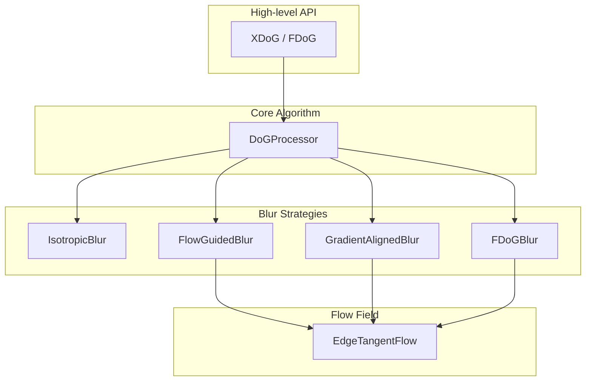

# DoG Line Drawing Library

A TypeScript implementation of Difference-of-Gaussians algorithms for artistic line drawing and edge stylization.

## Overview

This library turns photos into line drawings. You give it an image, tweak a few parameters, and get back stylized edges that look hand-drawn rather than computer-generated.

| Original | HDoG |
|----------|-----|
|  |  |

There are four main algorithms:
* XDoG is the fast, line-only option. It applies Gaussian blurs at two different scales, subtracts them to find edges, then applies a soft threshold to create the final look. You can dial it from soft pencil shading to stark black-and-white woodcut with just a few parameter changes. Processing is nearly instant on modern hardware, but like FDoG, it only captures structure; it has no notion of tone or shading.
* FDoG is the quality line-drawing option. It does everything XDoG does, but first computes a "flow field" that tracks the direction of edges throughout the image, then blurs along those edges instead of uniformly in all directions. The result is smoother, more coherent lines (like an illustrator would draw) but it takes 3-5x longer to process. Like XDoG, it only produces lines; no tone or shading.
* ADoG is the screentoning option. It repurposes the same Gaussian subtraction as XDoG/FDoG, but makes it sensitive to local brightness, so darker regions get denser tone and lighter regions stay sparse. The output is dot-like primitives approximating shading, similar to stippling but without a complex placement algorithm.
* HDoG is the hybrid option. It combines FDoG's line extraction with ADoG's screentoning into one output, giving you structure and shading together where either alone falls short. It costs more than a single pass, but stays linear-time and GPU-friendly like the others.

Both XDog and FDoG algorithms share the same parameter space for controlling line thickness, contrast, and threshold sharpness. The only difference is whether the blur respects edge direction.

| Subject   | Original | XDoG | FDoG | ADoG | HDoG | XDoG Multi-Scale |
|-----------|----------|------|------|------|------|-------------------|
| Chelsea   |  |  |  |  |  |  |
| House     |  |  |  |  |  |  |
| Landscape |  |  |  |  |  |  |
| Mandrill  |  |  |  |  |  |  |
| Peppers   |  |  |  |  |  |  |

## Installation

```bash
npm install xfdog
```

## Quick Start

### Basic XDoG

The simplest way to process an image is to create an XDoG instance and pass it canvas ImageData. The filter handles grayscale conversion internally:

```typescript
import { XDoG } from 'xdog';

// Create processor with default settings
const xdog = new XDoG();

// Process canvas ImageData
const canvas = document.getElementById('myCanvas') as HTMLCanvasElement;
const ctx = canvas.getContext('2d')!;
const imageData = ctx.getImageData(0, 0, canvas.width, canvas.height);

const result = await xdog.processChannelImageData(imageData);
xdog.dispose();
ctx.putImageData(result, 0, 0);
```

### Using Style Presets

The library includes several presets based on the parameter ranges documented in the original paper. These presets correspond to specific artistic styles demonstrated in the research:

```typescript
import { dog } from 'xdog';

// Use a preset directly
const xdog = new dog.XDoG(STYLE_PRESETS.pencilShading);

// Or use the factory method for cleaner code
const xdog2 = XDoG.withPreset('threshold');
const xdog3 = XDoG.withPreset('woodcut');
```

### FDoG for Coherent Lines

When working with images containing noise or fine textures, the FDoG produces substantially cleaner results by aligning the blur operations with the local edge structure. The technique computes an Edge Tangent Flow (ETF) from the smoothed structure tensor of image gradients, then uses this flow field to guide both the DoG computation and subsequent smoothing:

```typescript
import { dog } from 'xdog';

// Configure FDoG with flow-specific parameters
const fdog = new dog.FDoG({
  sigma: 1.4,      // Edge detection sigma (σe) - controls edge width
  sigmaC: 2.5,     // Structure tensor smoothing (σc) - controls ETF smoothness
  sigmaM: 4.0,     // Flow-aligned smoothing (σm) - controls line coherence
  sigmaA: 1.0,     // Anti-aliasing LIC sigma (σa)
  p: 20,           // Sharpening strength
  phi: 10,         // Threshold sharpness
});

const result = await fdog.processChannelImageData(imageData);
fdog.dispose();

// Or use a preset tuned for specific effects
const fdog2 = FDoG.withPreset('standard');
```

### Custom Configuration

Each parameter in the XDoG filter serves a specific purpose, and understanding their relationships allows for precise control over the output. The reparameterization used in this implementation (using `p` instead of `τ`) decouples edge sharpening strength from threshold parameters, making the filter much easier to control:

```typescript
import { dog } from 'xdog';

const xdog = new dog.XDoG({
  sigma: 1.4,      // Base blur size - controls scale of detected edges
  k: 1.6,          // Ratio between blur sizes (1.6 recommended as engineering trade-off)
  p: 20,           // Sharpening strength (replaces old τ parameter)
  epsilon: 0.78,   // Threshold point - values above become white
  phi: 100,        // Threshold sharpness - controls transition steepness
});

// Parameters can be overridden per-call without modifying the instance
const result = await xdog.process(grayscaleImage, { phi: 5 });
xdog.dispose();
```

## Configuration Parameters

### Understanding the DoG Operator

The DoG operator approximates the scale-normalized Laplacian of Gaussian and functions as a band-pass filter, extracting image features falling within a characteristic frequency band that corresponds to edge lines. The subtraction of two Gaussians with different σ creates this band-pass behavior, attenuating frequencies outside the range between the two cutoff frequencies.

From a neurobiological perspective, this center-surround mechanism mirrors how certain retinal cells behave, where stimulation of a central cell is inhibited by simultaneous excitation of its surrounding neighbors. This biological inspiration informed the original DoG formulation and helps explain why DoG-filtered images appear natural and visually appealing.

### Core DoG Parameters

| Parameter | Default | Range | Description |
|-----------|---------|-------|-------------|
| `sigma` | 1.0 | 0.3–8.0 | The base Gaussian blur σ that controls the scale of detected edges. Smaller values capture fine details but may amplify noise, while larger values detect only coarse edges and produce broader strokes. The paper typically uses values between 0.4 and 2.0 for most styles. |
| `k` | 1.6 | 1.1–3.0 | The ratio between the two Gaussian blur sizes. Marr and Hildreth recommended k = 1.6 as a good engineering trade-off between accurate approximation of the Laplacian and adequate sensitivity. This value approximates the Laplacian of Gaussian effectively. |
| `p` | 20.0 | 0–150+ | The sharpening strength parameter from the reparameterized formulation. At p ≈ 0, the filter produces no edge enhancement (just a blurred image). At p ≈ 20, edges are strongly emphasized and suitable for most stylization. Values of 100+ create extreme emphasis for woodcut-style effects. |
| `epsilon` | 0.5 | 0–1 | The threshold value controlling the transition between white and black regions. Values above ε become white, while values below follow the soft threshold function. For normalized images, this should typically be in the 0.5–0.8 range. |
| `phi` | 10.0 | 0.01–200 | Controls the steepness of the tanh soft threshold function. Very low values (≈ 0.01) produce soft, gradual transitions suitable for pencil shading and pastel effects. High values (100+) approach a step function, producing hard black/white edges suitable for thresholding and woodcut styles. |

### Pluggable Threshold Strategies

The library provides multiple thresholding strategies to handle different image characteristics and artistic preferences. You can plug in different strategies via the `thresholdStrategy` parameter in the DoG config:

#### Soft Threshold (Default)

The classic approach using a soft tanh function: `T_ε,φ(u) = 1 + tanh(φ · (u - ε))`

```typescript
import { dog, threshold } from 'xdog';

const xdog = new dog.XDoG({
  sigma: 1.4,
  thresholdStrategy: new threshold.SoftThresholdStrategy(),
});
```

**Use when:** You want smooth, gradual transitions between black and white—ideal for pencil and pastel styles.

#### Hysteresis Threshold (Canny-style)

Uses two thresholds to produce connected edge traces, inspired by Canny edge detection:

```typescript
import { dog, threshold } from 'xdog';

const xdog = new dog.XDoG({
  sigma: 1.4,
  thresholdStrategy: new threshold.HysteresisThresholdStrategy(0.5, 0.75),
});
```

**How it works:**
1. Strong edges (above `epsilonHigh`) are always kept
2. Weak edges (between `epsilon` and `epsilonHigh`) are retained only if connected to strong edges
3. Values below `epsilon` are discarded

**Benefits:**
- Produces clean, connected edge traces
- Eliminates floating fragments
- Less sensitive to threshold parameter tuning
- Produces results similar to professional line art

**Use when:** You want guaranteed connected edges and clean, professional-looking line art.

### Spatially-Varying Parameters

`p`, `epsilon`, and `phi` each accept either a single `number` (applied uniformly, as in every example above) or a `ChannelImage`; a per-pixel map with the same width/height as the input. This drives sharpening strength and threshold behavior from per-pixel data, most commonly a texture-strength map, instead of one global setting for the whole image.

```typescript
import { dog } from 'xdog';

const xdog = new dog.XDoG({ sigma: 1.0, k: 1.6, phi: 10 });

// epsilonMap is a ChannelImage, same width/height as grayImage
const result = await xdog.process(grayImage, { epsilon: epsilonMap });
xdog.dispose();
```

Nothing else about calling XDoG/FDoG changes. Any parameter resolves per-pixel automatically wherever a `ChannelImage` is passed instead of a number.

#### Building a Texture-Adaptive Map

The most common use is texture suppression: real photographs often have regions (skin, fabric, foliage) where fine texture creates edge noise. Score each pixel with a texture-detection preprocessor, then derive adaptive `p`/`epsilon` maps from that score:

```typescript
import { dog, preprocess } from 'xdog';

const textureMap = new preprocess.LocalVariancePreprocessor({ windowRadius: 2 }).process(grayImage);
// textureMap: ChannelImage, 0 = pure structure, 1 = pure texture

function adaptiveMap(base: number, sensitivity: number, texture: ChannelImage): ChannelImage {
  const data = new Float32Array(texture.data.length);
  for (let i = 0; i < data.length; i++) {
    data[i] = base + sensitivity * texture.data[i];
  }
  return { data, width: texture.width, height: texture.height };
}

const pMap = adaptiveMap(20, -10, textureMap);        // weaker sharpening in texture
const epsilonMap = adaptiveMap(0.5, 0.3, textureMap); // higher threshold in texture

const xdog = new dog.XDoG({ sigma: 1.0, k: 1.6, phi: 10 });
const result = await xdog.process(grayImage, { p: pMap, epsilon: epsilonMap });
```

**Important:** per Winnemöller et al., `p` (the DoG mixing weight) changes the average brightness of the filtered response. When varying `p` spatially, vary `epsilon` from the *same* texture map at the same time; adjusting only one produces a visible local brightness shift rather than clean texture suppression.

Works identically with `FDoG`: pass the same overrides; the flow parameters (`sigmaC`, `sigmaM`, `sigmaA`) are unaffected.

**Use when:** your source images have regions of fine texture that clutter the output with unwanted edges, but you still want sharp, clean structural edges preserved elsewhere in the same image.


### FDoG-Specific Parameters

The FDoG extends the basic DoG by replacing the single σ parameter with three separate parameters, each controlling a different stage of the flow-guided processing pipeline:

| Parameter | Default | Range | Description |
|-----------|---------|-------|-------------|
| `sigmaC` | 2.5 | 0.1–8.0 | Controls the width of the Gaussian used to blur the structure tensor when computing the Edge Tangent Flow. Small values can increase noise in the flow field but capture fine edge directions. Larger values smooth the flow but may distort fine features. |
| `sigmaM` | 4.0 | 0–25 | Controls the width of the edge tangent-aligned line integral convolution that smooths the DoG response along edges. Larger values increase coherence by combining shorter disconnected segments into longer, continuous lines. However, very large values relative to σc may introduce noise into the edge lines. |
| `sigmaA` | 1.0 | 0–10 | Applied as a post-processing line integral convolution along the ETF for anti-aliasing. A value of 0 disables this pass. Values of 0.5–2 provide typical anti-aliasing, while larger values create stylistic smoothing effects. |

## Style Presets

### XDoG Presets (`STYLE_PRESETS`)

These presets are derived from the parameter settings documented in Appendix A of the paper and correspond to specific figures and style demonstrations:

| Preset | Description | Key Settings |
|--------|-------------|--------------|
| `pencilShading` | High-frequency detail resembling graphite on paper. The small σ captures fine texture, and the very low φ ensures soft, gradual tonal transitions that mimic the way graphite builds up on paper. | σ=0.4, p=20, φ=0.01 |
| `pastel` | Intermediate edge width with mostly white regions. The higher ε threshold pushes most values to white, while the low φ maintains soft color transitions. | σ=2.0, p=40, φ=0.01 |
| `charcoal` | Broad strokes from large spatial support. The large σ discards fine detail and captures only major forms, creating the bold, expressive quality associated with charcoal drawing. | σ=7.0, p=70, φ=0.01 |
| `threshold` | Clean black and white line art. The high φ creates a near step-function threshold, producing the stark two-tone images suitable for comics and technical illustration. | σ=1.4, p=20, φ=100 |
| `woodcut` | Extreme edge emphasis with aggressive contrast. The very high p value creates dramatic edge exaggeration, mimicking the carved appearance of traditional xylography. | σ=0.8, p=120, φ=100 |

### FDoG Presets (`FDOG_STYLE_PRESETS`)

These presets combine the core DoG parameters with flow-specific settings for different artistic effects:

| Preset | Description | Key Settings |
|--------|-------------|--------------|
| `standard` | Coherent line drawing with smooth, connected edges. The balanced σc and σm values produce clean flow-aligned results suitable for most portrait and figure work. | σc=2.28, σm=4.4, σa=1.0 |
| `pastel` | Flow-aligned smoothing with noticeable turbulence. The minimal structure tensor smoothing combined with large flow smoothing creates visible brush-stroke-like texture along edges. | σc=0.1, σm=20, σa=7.2 |
| `woodcut` | Aggressive flow distortion for dramatic carved effects. The larger σc creates very smooth flow fields, while the moderate σm maintains some edge definition. | σc=5.84, σm=3.2, σa=0.75 |

## Color-Aware Stylization

While the standard XDoG/FDoG algorithms operate on grayscale images, color information can be leveraged to produce stylizations that better respect color boundaries and perceptual edges. The library provides utilities and patterns for color-aware processing:

### Approach 1: Independent RGB Channel Processing

Process each color channel independently and combine the edge responses using maximum (most aggressive detection):

```typescript
import { dog, utilities } from 'xdog';

async function xdogColorAware(imageData: ImageData): Promise<ImageData> {
  const width = imageData.width;
  const height = imageData.height;
  
  // Extract R, G, B channels separately
  const channels = {
    r: utilities.createChannelImage(width, height),
    g: utilities.createChannelImage(width, height),
    b: utilities.createChannelImage(width, height),
  };
  
  for (let i = 0; i < imageData.data.length; i += 4) {
    const pixelIdx = i / 4;
    channels.r.data[pixelIdx] = imageData.data[i] / 255;
    channels.g.data[pixelIdx] = imageData.data[i + 1] / 255;
    channels.b.data[pixelIdx] = imageData.data[i + 2] / 255;
  }
  
  // Process each channel
  const xdog = new dog.XDoG();
  const [resultR, resultG, resultB] = await Promise.all([
    xdog.process(channels.r),
    xdog.process(channels.g),
    xdog.process(channels.b),
  ]);
  xdog.dispose();

  // Combine: take maximum (most aggressive edge detection)
  const combined = utilities.createChannelImage(width, height);
  for (let i = 0; i < width * height; i++) {
    combined.data[i] = Math.max(resultR.data[i], resultG.data[i], resultB.data[i]);
  }
  
  return utilities.luminanceToImageData(combined);
}
```

**Formula:** `E_color = max(E_R, E_G, E_B)`

**Advantages:**
- Detects edges that are prominent in any color channel
- Preserves color boundaries even when individual channels have weak edges
- Simple to implement and understand
- No color space conversion needed

**Use cases:**
- Photography with varied color distribution
- When color transitions should produce visible edges
- Images where different colors carry different edge information

### Approach 2: Perceptually-Weighted Lab Color Space

Convert to Lab color space and apply weighted combination, with higher weight on luminance (L) which aligns with human perception:

```typescript
import { dog, utilities } from 'xdog';

async function xdogPerceptual(imageData: ImageData): Promise<ImageData> {
  const width = imageData.width;
  const height = imageData.height;
  
  // Convert RGB to Lab color space
  const lab = rgbToLab(imageData);
  
  // Extract L (luminance) and a/b (chrominance) channels
  const L = lab.l;
  const ab = utilities.createChannelImage(width, height);
  
  for (let i = 0; i < width * height; i++) {
    // Combine a and b components as chroma
    ab.data[i] = Math.sqrt(lab.a.data[i] ** 2 + lab.b.data[i] ** 2) / 255;
  }
  
  // Process each component
  const xdog = new dog.XDoG();
  const [resultL, resultAB] = await Promise.all([
    xdog.process(L),
    xdog.process(ab),
  ]);
  xdog.dispose();
  
  // Combine with perceptual weighting
  const combined = utilities.createChannelImage(width, height);
  const wL = 0.8;   // 80% weight to luminance (human eyes are more sensitive)
  const wAB = 0.2;  // 20% weight to color information
  
  for (let i = 0; i < width * height; i++) {
    combined.data[i] = wL * resultL.data[i] + wAB * resultAB.data[i];
  }
  
  return utilities.luminanceToImageData(combined);
}

function rgbToLab(imageData: ImageData): { l: ChannelImage; a: ChannelImage; b: ChannelImage } {
  const width = imageData.width;
  const height = imageData.height;
  const l = createChannelImage(width, height);
  const a = createChannelImage(width, height);
  const b = createChannelImage(width, height);
  
  for (let i = 0; i < imageData.data.length; i += 4) {
    const pixelIdx = i / 4;
    const r = imageData.data[i] / 255;
    const g = imageData.data[i + 1] / 255;
    const b_val = imageData.data[i + 2] / 255;
    
    // RGB to XYZ using D65 illuminant
    const x = r * 0.4124 + g * 0.3576 + b_val * 0.1805;
    const y = r * 0.2126 + g * 0.7152 + b_val * 0.0722;
    const z = r * 0.0193 + g * 0.1192 + b_val * 0.9505;
    
    // XYZ to Lab
    const fx = x > 0.008856 ? Math.cbrt(x) : (7.787 * x + 16 / 116);
    const fy = y > 0.008856 ? Math.cbrt(y) : (7.787 * y + 16 / 116);
    const fz = z > 0.008856 ? Math.cbrt(z) : (7.787 * z + 16 / 116);
    
    l.data[pixelIdx] = (116 * fy - 16) / 100;  // Normalize to 0-1
    a.data[pixelIdx] = (500 * (fx - fy) + 128) / 255;  // Normalize
    b.data[pixelIdx] = (200 * (fy - fz) + 128) / 255;  // Normalize
  }
  
  return { l, a, b };
}
```

**Formula:** `E = w_L · E_L + w_ab · E_ab` where w_L ≈ 0.8, w_ab ≈ 0.2

**Advantages:**
- Aligns with human visual perception (eyes are ~5x more sensitive to luminance than color)
- Stronger edges where human observers perceive them
- Color information preserved but less prominent than structure
- Better results for photographs of natural scenes

**Use cases:**
- Photographs with subtle color variations and strong luminance structure
- When perceptual edge detection is more important than technical precision
- Artistic stylization that respects color harmony and human perception
- Scenes with mixed lighting conditions

## Preprocessing

Real-world photographs often contain texture and noise (grass, fabric, skin pores) that creates excessive detail in the output. As discussed in Section 3.2 of the paper, bilateral preprocessing serves as a "prioritization mechanism" for indication—attenuating weak edges while supporting strong edges. This effectively performs automatic indication of mostly homogeneous textures, focusing the viewer's attention on the important structural edges.

```typescript
import { 
  XDoG, 
  utilities,
  preprocess
} from 'xdog';

// Convert your image to grayscale
const grayscale = utilities.imageDataToGrayscale(canvasImageData);

// Apply preprocessing appropriate to your image content
const cleaned = preprocess.PreprocessingPresets.standard(grayscale);

// Process with XDoG
const xdog = new XDoG(STYLE_PRESETS.threshold);
const result = await xdog.process(cleaned);
```

### Preprocessing Presets

The choice of preprocessing depends on the characteristics of your source image and the desired balance between detail preservation and noise reduction:

| Preset | Best For | Description |
|--------|----------|-------------|
| `light` | Clean studio photos, illustrations, already-processed images | Minimal bilateral smoothing that preserves fine detail while removing only obvious noise. |
| `standard` | Most outdoor photos, portraits, general photography | A balanced smoothing pass that removes typical photographic noise and minor texture while preserving important edges. |
| `heavy` | Very textured images such as fabric, foliage-heavy backgrounds, or rough surfaces | Multiple bilateral passes that aggressively smooth texture. Use when the background contains repetitive detail that would otherwise dominate the output. |
| `nature` | Landscapes, grass, beaches, foliage | Specifically tuned for natural texture like grass and leaves, which contains structure at multiple scales that can overwhelm edge detection. |
| `artistic` | When seeking a painterly, stylized output | Combines Kuwahara filtering for flat, posterized regions with bilateral smoothing, creating a foundation suitable for more abstract results. |

### Custom Preprocessing Pipeline

For fine control over preprocessing, you can chain multiple operations using the Preprocessor class. The bilateral filter is the most important tool here—it smooths texture while preserving edges by averaging pixels based on both spatial proximity and intensity similarity:

```typescript
import { preprocess } from 'xdog';

const preprocessor = new preprocess.Preprocessor()
  .bilateral({ sigmaSpatial: 6, sigmaRange: 0.15 })  // First pass: broad smoothing
  .bilateral({ sigmaSpatial: 3, sigmaRange: 0.08 })  // Second pass: refine edges
  .contrast(0.01, 0.99);  // Stretch histogram to use full range

const cleaned = preprocessor.apply(grayscale);
```

### Available Filters

The library provides several filtering functions that can be used individually or combined in custom pipelines:

```typescript
import { 
  bilateralFilter,   // Edge-preserving smoothing based on spatial and intensity distance
  medianFilter,      // Replaces each pixel with neighborhood median; excellent for salt-and-pepper noise
  kuwaharaFilter,    // Creates painterly flat regions by selecting the lowest-variance quadrant
  gaussianBlur,      // Simple isotropic smoothing (less edge-preserving than bilateral)
  enhanceContrast,   // Histogram stretching to increase dynamic range
  quantize           // Reduces intensity levels for posterization effects
} from 'xdog';
```

## Architecture

The library uses a composition-based design that separates the core DoG algorithm from the blur implementation, allowing different blur strategies to be used interchangeably. This mirrors the theoretical structure where XDoG and FDoG differ primarily in how they compute their Gaussian blurs:



### Extending with Custom Blur Strategies

The BlurStrategy interface allows you to implement custom blur algorithms for specialized effects. For instance, you might implement a motion-blur-aligned strategy to create speed-line effects, or a radial blur for zoom effects:

```typescript
import { BlurStrategy, DoGProcessor, ChannelImage } from 'xdog';

class MyCustomBlur implements BlurStrategy {
  async blur(input: ChannelImage, sigma: number): Promise<ChannelImage> {
    // Your implementation here
  }
}

const processor = new DoGProcessor(new MyCustomBlur(), { sigma: 1.0, p: 20 });
```

### Checking Strategy Availability

Each blur strategy provides a static method to check runtime availability, useful when some implementations may require specific browser capabilities:

```typescript
import { blur } from 'xdog';

// Pure JavaScript implementations are always available
console.log(blur.IsotropicBlur.isSupported()); // true
console.log(blur.FlowGuidedBlur.isSupported()); // true
```

## Working with Grayscale Images

For performance-critical applications or batch processing, working directly with the internal grayscale image format avoids repeated conversions. The library uses Float32Array storage with values normalized to the 0–1 range:

```typescript
import { 
  dog, 
  utilities
} from 'xdog';

// Convert from canvas ImageData (handles RGBA to grayscale conversion)
const grayscale = utilities.imageDataToGrayscale(imageData);

// Process
const xdog = new dog.XDoG();
const result = await xdog.process(grayscale);
xdog.dispose();

// Convert back to ImageData for display
const outputImageData = utilities.grayscaleToImageData(result);
```

## Advanced FDoG Usage

### Visualizing Edge Tangent Flow

The Edge Tangent Flow field represents the direction of edges at each pixel and can be visualized for debugging or artistic purposes. Understanding the ETF helps in tuning the σc parameter:

```typescript
import { dog, utilities } from 'xdog';

const fdog = new dog.FDoG();
const grayscale = utilities.imageDataToLuminance(imageData);

// Compute ETF separately
const etf = fdog.computeETF(grayscale);

// Visualize as color image (direction encoded as hue)
const flowViz = etf.visualizeColor();
etf.dispose();
ctx.putImageData(flowViz, 0, 0);

// Or draw tangent vectors manually for detailed inspection
for (let y = 0; y < height; y += 10) {
  for (let x = 0; x < width; x += 10) {
    const tangent = etf.getTangent(x, y);
    ctx.beginPath();
    ctx.moveTo(x, y);
    ctx.lineTo(x + tangent.x * 5, y + tangent.y * 5);
    ctx.stroke();
  }
}
```

### Processing with Pre-computed ETF

For video processing or animation, computing the ETF once and reusing it across multiple frames can significantly improve performance. This is particularly useful when the scene structure remains relatively stable between frames:

```typescript
const etf = fdog.computeETF(grayscale);

// Process multiple frames with the same flow field
const result1 = await fdog.processWithETF(frame1, etf);
const result2 = await fdog.processWithETF(frame2, etf);
fdog.dispose();
etf.dispose();
```

### Detailed Processing Pipeline

For debugging or when you need access to intermediate results, the processDetailed method exposes each stage of the FDoG pipeline:

```typescript
const { result, etf, sharpened, thresholded, smoothed } = 
  await fdog.processDetailed(grayscale);

// Access intermediate results:
// - etf: the computed Edge Tangent Flow
// - sharpened: the DoG-enhanced image before thresholding
// - thresholded: after soft threshold applied
// - smoothed: after flow-aligned smoothing
// - result: final output after anti-aliasing
etf.dispose();
```


## ADoG (Adaptive Difference of Gaussians)

ADoG produces a screentoning effect: rather than a uniform black-and-white edge threshold, it generates a halftone-like pattern whose density is inversely proportional to local brightness. Dark regions fill in with a dense, noisy texture; light regions stay clean. It's the tool to reach for when you want a manga/comic-style screentone look rather than a line drawing.

Based on: Kang, H. & Stamoulis, N. (2021), "Gaussian Image Binarization" (Section 3.2, Eqs. 3–6).

### How it works

XDoG and FDoG both use a single global contrast-sensitivity value in their DoG computation — every pixel gets the same edge/noise sensitivity. ADoG's key idea is to make that sensitivity a function of the pixel's own tone:

1. **Adaptive noise injection (optional, Eq. 6):** before blurring, per-pixel Gaussian noise is added to the input, scaled by `c * (1 - tanh(s * I(x)))`. Darker pixels get more noise, lighter pixels get almost none. This is what gives the darker regions their grainy, screentone-like texture. Set `noiseScaleC: 0` to skip this step entirely.
2. **Two isotropic blurs**, same as XDoG: `sigma` (σc) and `sigma * k` (σs).
3. **Per-pixel adaptive weight ρ(x) (Eq. 5):** `ρ(x) = τ + (1 - τ) * (1 - tanh(s * I(x)))`, computed from the *original*, pre-noise input. ρ ranges within `[τ, 1]` — darker pixels push ρ toward 1 (full-strength DoG response, more texture), brighter pixels push ρ toward τ (a nearly flat, textureless response).
4. **Weighted DoG (Eq. 4):** `ADoG(x) = G_σc(x) - ρ(x) * G_σs(x)`, i.e. an ordinary DoG where the surround term's contribution is itself brightness-dependent.
5. **Threshold:** hard threshold by default (`HardThresholdStrategy`), producing a binarized screentone.

The net effect: shadows get progressively denser screentone dots/noise as they get darker, while highlights stay clean — much like halftone printing responds to tone.

### Usage

```typescript
import { dog } from 'xdog';

const adog = new dog.ADoG({
  sigma: 1.0,        // σc
  k: 1.6,             // σs = k * σc
  tau: 0.99,          // minimum contrast sensitivity
  s: 2.0,             // steepness of the tone-dependent falloff
  noiseScaleC: 0.01,  // adaptive noise strength (0 disables noise injection)
});

const result = await adog.process(grayscaleImage);
adog.dispose();

// Or use the bundled preset
const adog2 = new dog.ADoG(dog.ADOG_STYLE_PRESETS.standard);
```

For access to intermediate stages (the per-pixel p map, the noise-injected input, or the unweighted (standard DoG) response for comparison) use `processDetailed`:

```typescript
const { result, sharpened, rawDoG, rhoMap, noisyInput } = await adog.processDetailed(grayscaleImage);

// result:     final binarized screentone
// sharpened:  ρ-weighted DoG response, pre-threshold
// rawDoG:     unweighted DoG (ρ ≡ 1 everywhere) — standard DoG for comparison
// rhoMap:     the per-pixel adaptive sensitivity ρ(x)
// noisyInput: input after adaptive noise injection (or the original input if noiseScaleC === 0)
```

### ADoG-Specific Parameters

| Parameter | Default | Range | Description |
|-----------|---------|-------|--------------|
| `tau` | 0.99 | 0.97–1.0 | Minimum contrast sensitivity. ρ(x) is bounded within `[tau, 1]` — lower values allow brighter regions to still pick up some texture, higher values keep them cleaner. The paper restricts this range to avoid noisy artifacts. |
| `s` | 2.0 | — | Steepness of the tone-dependent falloff used in both ρ(x) (Eq. 5) and the adaptive noise scale (Eq. 6). Larger values concentrate the density transition into darker tones, so midtones stay cleaner and only true shadows screentone heavily. |
| `noiseScaleC` | 0.01 | 0 or positive | Strength of the adaptive noise injected before blurring (Eq. 6). Set to `0` to disable noise injection entirely — the screentone effect from ρ(x) weighting alone is often enough; noise injection adds extra grain in shadow regions. |
| `kernelSizeMultiplier` | 6 | — | Kernel size multiplier for the isotropic Gaussian blur, same meaning as XDoG's parameter of the same name. |

ADoG also inherits `sigma`, `k`, `epsilon`, and `phi` from the core `DoGConfig` (see the main parameter table above), though its defaults differ from XDoG's; notably a much lower `epsilon` (0.05) and higher `phi` (200), tuned for hard binarization rather than soft tonal transitions.

**Use when:** you want a halftone/screentone shading effect (e.g. manga backgrounds, Ben-Day dots, etc.) rather than clean line art. Combine with HDoG (below) if you also want linework on top.

---

## HDoG (Hybrid Difference of Gaussians)

HDoG combines FDoG's coherent linework with two passes of ADoG's screentoning at different scales, producing output that looks like a hand-inked illustration with halftone shading.  It does lines *and* tone in one pass, rather than lines *or* tone.

Implements Eq. (9) from the ADoG paper: `HDoG = FDoG ∧ ADoG_s ∧ ADoG_s'`

### How it works

HDoG runs three existing processors on the same input and combines their binarized outputs with a logical AND:

1. **FDoG pass:** produces coherent, flow-aligned line art (the "ink" layer).
2. **Primary ADoG pass** (scale `s`): produces screentone shading tuned to one density.
3. **Secondary ADoG pass** (scale `s' = s * adogSecondaryScaleFactor`, default `4s`): produces a second, denser screentone layer that only shows up in the darkest regions — the paper found `s' = 4s` adds extra shading to shadows without touching the midtones the primary pass already handles.
4. **AND-combine:** all three binarized outputs are combined pixel-wise: a pixel only stays "on" (part of the final image) if all three passes agree. This is why the FDoG lines act as a mask: the screentone only appears where FDoG hasn't already drawn a hard edge, and both ADoG scales must agree for a pixel to screentone.

Because it's running FDoG (flow field computation) and two full ADoG passes, HDoG is the most computationally expensive processor in the library.  Expect it to run longer despite the component processors running in parallel.

### Usage

```typescript
import { dog } from 'xdog';

const hdog = new dog.HDoG({
  fdog: {
    sigma: 1.4,
    sigmaC: 2.5,
    sigmaM: 4.0,
    sigmaA: 1.0,
  },
  adog: {
    sigma: 1.0,
    tau: 0.99,
    s: 2.0,
  },
  adogSecondaryScaleFactor: 4,  // s' = 4 * adog.s, per the paper's default
});

const result = await hdog.process(grayscaleImage);
hdog.dispose();

// Or the one-shot convenience function, matching xdog()/fdog()/adog()
const result2 = await dog.hdog(grayscaleImage);
```

If you need to tweak just the secondary ADoG pass's threshold behavior without recomputing its `s` from scratch, use `adogSecondary` as a targeted override on top of the derived secondary config:

```typescript
const hdog = new dog.HDoG({
  adog: { sigma: 1.0, s: 2.0 },
  adogSecondaryScaleFactor: 4,     // derived s' = 8.0
  adogSecondary: { epsilon: 0.03 }, // override just epsilon on the secondary pass
});
```

For the individual per-pass outputs (useful for debugging or building custom composites), use `processDetailed`:

```typescript
const {
  result,               // final AND-combined output
  sharpened,            // FDoG's sharpened image, exposed as a representative pre-threshold stage
  fdogResult,           // FDoG's binarized line art on its own
  adogPrimaryResult,    // primary ADoG screentone on its own
  adogSecondaryResult,  // secondary (denser) ADoG screentone on its own
} = await hdog.processDetailed(grayscaleImage);
hdog.dispose();
```

### Configuration Notes

Unlike XDoG/FDoG/ADoG, `HDoGConfig` is nested rather than a flat `DoGConfig`, since it's really three sub-processor configs plus a scale factor:

| Field | Description |
|-------|-------------|
| `fdog` | `Partial<FDoGConfig>` passed straight through to the internal FDoG instance. |
| `adog` | `Partial<ADoGConfig>` passed to the primary ADoG instance. |
| `adogSecondaryScaleFactor` | Default `4`. The secondary ADoG pass reuses `adog`'s config but overrides `s` with `s * adogSecondaryScaleFactor` — this is the paper's `s' = 4s`. |
| `adogSecondary` | Optional partial override applied on top of the derived secondary config, for tweaking fields like `epsilon`/`phi` on just that pass. |

Because the config is nested, HDoG doesn't support the same flat per-call `overrides` argument that XDoG/FDoG/ADoG expose on `process()` — there's no unambiguous way to map a flat override onto "the FDoG config, or the ADoG config, or the scale factor." Configure HDoG through its constructor; construct a new instance (or call `dispose()` on the old one first) if you need different settings.

**Use when:** you want a single output that reads as a finished illustration — inked lines plus tonal shading — rather than choosing between line art (FDoG) or screentone (ADoG) alone.


## Performance Considerations

The XDoG filter is computationally efficient and suitable for real-time use on most modern devices. The Gaussian blur operations are separable and implemented as two successive one-dimensional convolutions, one horizontal and one vertical.

The FDoG is more computationally expensive due to ETF computation (which requires computing and smoothing the structure tensor, then refining the tangent field iteratively) and the line integral convolution passes for flow-aligned smoothing. For video processing with FDoG, consider these strategies:

- Compute the ETF on keyframes and interpolate between them for intermediate frames.
- Use `processWithETF()` with a shared flow field when scene structure is stable.
- Downscale the image for ETF computation, then use the flow field at full resolution.
- Cache and reuse the ETF when processing the same image with different XDoG parameters.

### Resource Cleanup with `dispose()`

Blur strategies in this library can be backed by WebGL/WebGPU (see `isSupported()` on each strategy above) to accelerate the Gaussian and flow-guided convolutions. GPU resources are **not** managed by JavaScript's garbage collector. An `XDoG`, `ADoG`, or `HDoG` instance holds onto its blur strategy (and, for `HDoG`, three sub-processor instances) for as long as it's configured to be reused across calls, so those resources stay allocated on the GPU until you explicitly release them:

```typescript
const xdog = new XDoG({ sigma: 1.4, p: 20 });

// ... use xdog.process() as many times as you like ...

xdog.dispose(); // releases the underlying GPU context/buffers
```

**Always call `dispose()`** when you're done with an instance.  Not just at the end of a script, but any time you create one in a loop, a request handler, or a component that mounts/unmounts repeatedly. Failing to do so leaks GPU memory, which can degrade performance or exhaust context limits (most browsers cap the number of live WebGL contexts) over a long-running session.

```typescript
// Bad: creates and abandons a new GPU-backed instance per image
for (const image of images) {
  const xdog = new XDoG();
  results.push(await xdog.process(image)); // xdog is never disposed
}

// Good: reuse one instance, dispose once
const xdog = new XDoG();
try {
  for (const image of images) {
    results.push(await xdog.process(image));
  }
} finally {
  xdog.dispose();
}
```

The one-shot convenience functions (`xdog()`, `fdog()`, `adog()`, `hdog()`) already call `dispose()` internally after processing, so they're safe to use without any extra cleanup — but each call pays the cost of allocating a fresh GPU context. For repeated processing (video frames, batch jobs, multiple images), construct and reuse a single instance instead, and dispose of it yourself once you're finished.

A few implementation notes worth knowing:

- **`HDoG.dispose()`** disposes its internal `FDoG` and both `ADoG` instances for you.
- **`FDoG.dispose()`** is currently a no-op: `FDoG.process()`/`processDetailed()` create their ETF and blur strategies fresh on each call and dispose of them internally before returning, so an `FDoG` instance doesn't hold persistent GPU state between calls the way `XDoG`/`ADoG` do. It's still safe (and future-proof) to call `dispose()` on an `FDoG` instance when you're done with it.
- Calling `process()` on a disposed instance is undefined behavior — don't reuse an instance after calling `dispose()` on it. Construct a new one if you need to process more images.

## References

- Winnemöller, H., Kyprianidis, J. E., & Olsen, S. C. (2012). "XDoG: An eXtended difference-of-Gaussians compendium including advanced image stylization." Computers & Graphics, Vol. 36, Issue 6, pp. 720–753.
- Kang, H., Lee, S., & Chui, C. K. (2007). "Coherent line drawing." Proceedings of NPAR '07, pp. 43–50.
- Kang, H., & Stamoulis, I. (2021). "Gaussian Image Binarization." International Journal of Image and Graphics, Vol. 21, No. 4, 2150047.
- Kyprianidis, J. E., & Döllner, J. (2008). "Image abstraction by structure adaptive filtering." Proc. EG UK Theory and Practice of Computer Graphics, pp. 51–58.
- Marr, D., & Hildreth, E. C. (1980). "Theory of edge detection." Proc. Royal Society of London, Biological Sciences, Vol. 207, pp. 187–217.

## License

MIT