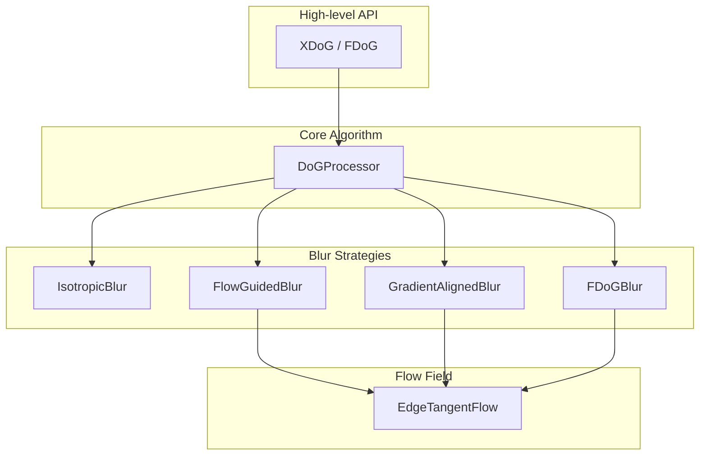

# XDoG / FDoG Line Drawing Library

A TypeScript implementation of Extended Difference-of-Gaussians (XDoG) and Flow-based Difference-of-Gaussians (FDoG) algorithms for artistic line drawing and edge stylization.

Based on: "XDoG: An eXtended difference-of-Gaussians compendium including advanced image stylization" by Winnemöller et al. (2012)

## Overview

This library turns photos into line drawings. You give it an image, tweak a few parameters, and get back stylized edges that look hand-drawn rather than computer-generated.

There are two main algorithms:
* XDoG is the fast option. It applies Gaussian blurs at two different scales, subtracts them to find edges, then applies a soft threshold to create the final look. You can dial it from soft pencil shading to stark black-and-white woodcut with just a few parameter changes. Processing is nearly instant on modern hardware.
* FDoG is the quality option. It does everything XDoG does, but first computes a "flow field" that tracks the direction of edges throughout the image. Then it blurs along those edges instead of uniformly in all directions. The result is smoother, more coherent lines (like an illustrator would draw) but it takes 3-5x longer to process.
Both algorithms share the same parameter space for controlling line thickness, contrast, and threshold sharpness. The only difference is whether the blur respects edge direction.


## Installation

```bash
npm install xfdog
```

## Quick Start

### Basic XDoG

The simplest way to process an image is to create an XDoG instance and pass it canvas ImageData. The filter handles grayscale conversion internally:

```typescript
import { XDoG } from 'xdog';

// Create processor with default settings
const xdog = new XDoG();

// Process canvas ImageData
const canvas = document.getElementById('myCanvas') as HTMLCanvasElement;
const ctx = canvas.getContext('2d')!;
const imageData = ctx.getImageData(0, 0, canvas.width, canvas.height);

const result = await xdog.processImageData(imageData);
ctx.putImageData(result, 0, 0);
```

### Using Style Presets

The library includes several presets based on the parameter ranges documented in the original paper. These presets correspond to specific artistic styles demonstrated in the research:

```typescript
import { XDoG, STYLE_PRESETS } from 'xdog';

// Use a preset directly
const xdog = new XDoG(STYLE_PRESETS.pencilShading);

// Or use the factory method for cleaner code
const xdog2 = XDoG.withPreset('threshold');
const xdog3 = XDoG.withPreset('woodcut');
```

### FDoG for Coherent Lines

When working with images containing noise or fine textures, the FDoG produces substantially cleaner results by aligning the blur operations with the local edge structure. The technique computes an Edge Tangent Flow (ETF) from the smoothed structure tensor of image gradients, then uses this flow field to guide both the DoG computation and subsequent smoothing:

```typescript
import { FDoG, FDOG_STYLE_PRESETS } from 'xdog';

// Configure FDoG with flow-specific parameters
const fdog = new FDoG({
  sigma: 1.4,      // Edge detection sigma (σe) - controls edge width
  sigmaC: 2.5,     // Structure tensor smoothing (σc) - controls ETF smoothness
  sigmaM: 4.0,     // Flow-aligned smoothing (σm) - controls line coherence
  sigmaA: 1.0,     // Anti-aliasing LIC sigma (σa)
  p: 20,           // Sharpening strength
  phi: 10,         // Threshold sharpness
});

const result = await fdog.processImageData(imageData);

// Or use a preset tuned for specific effects
const fdog2 = FDoG.withPreset('standard');
```

### Custom Configuration

Each parameter in the XDoG filter serves a specific purpose, and understanding their relationships allows for precise control over the output. The reparameterization used in this implementation (using `p` instead of `τ`) decouples edge sharpening strength from threshold parameters, making the filter much easier to control:

```typescript
import { XDoG } from 'xdog';

const xdog = new XDoG({
  sigma: 1.4,      // Base blur size - controls scale of detected edges
  k: 1.6,          // Ratio between blur sizes (1.6 recommended as engineering trade-off)
  p: 20,           // Sharpening strength (replaces old τ parameter)
  epsilon: 0.78,   // Threshold point - values above become white
  phi: 100,        // Threshold sharpness - controls transition steepness
});

// Parameters can be overridden per-call without modifying the instance
const result = await xdog.process(grayscaleImage, { phi: 5 });
```

## Configuration Parameters

### Understanding the DoG Operator

The DoG operator approximates the scale-normalized Laplacian of Gaussian and functions as a band-pass filter, extracting image features falling within a characteristic frequency band that corresponds to edge lines. The subtraction of two Gaussians with different σ creates this band-pass behavior, attenuating frequencies outside the range between the two cutoff frequencies.

From a neurobiological perspective, this center-surround mechanism mirrors how certain retinal cells behave, where stimulation of a central cell is inhibited by simultaneous excitation of its surrounding neighbors. This biological inspiration informed the original DoG formulation and helps explain why DoG-filtered images appear natural and visually appealing.

### Core DoG Parameters

| Parameter | Default | Range | Description |
|-----------|---------|-------|-------------|
| `sigma` | 1.0 | 0.3–8.0 | The base Gaussian blur σ that controls the scale of detected edges. Smaller values capture fine details but may amplify noise, while larger values detect only coarse edges and produce broader strokes. The paper typically uses values between 0.4 and 2.0 for most styles. |
| `k` | 1.6 | 1.1–3.0 | The ratio between the two Gaussian blur sizes. Marr and Hildreth recommended k = 1.6 as a good engineering trade-off between accurate approximation of the Laplacian and adequate sensitivity. This value approximates the Laplacian of Gaussian effectively. |
| `p` | 20.0 | 0–150+ | The sharpening strength parameter from the reparameterized formulation. At p ≈ 0, the filter produces no edge enhancement (just a blurred image). At p ≈ 20, edges are strongly emphasized and suitable for most stylization. Values of 100+ create extreme emphasis for woodcut-style effects. |
| `epsilon` | 0.5 | 0–1 | The threshold value controlling the transition between white and black regions. Values above ε become white, while values below follow the soft threshold function. For normalized images, this should typically be in the 0.5–0.8 range. |
| `phi` | 10.0 | 0.01–200 | Controls the steepness of the tanh soft threshold function. Very low values (≈ 0.01) produce soft, gradual transitions suitable for pencil shading and pastel effects. High values (100+) approach a step function, producing hard black/white edges suitable for thresholding and woodcut styles. |

### FDoG-Specific Parameters

The FDoG extends the basic DoG by replacing the single σ parameter with three separate parameters, each controlling a different stage of the flow-guided processing pipeline:

| Parameter | Default | Range | Description |
|-----------|---------|-------|-------------|
| `sigmaC` | 2.5 | 0.1–8.0 | Controls the width of the Gaussian used to blur the structure tensor when computing the Edge Tangent Flow. Small values can increase noise in the flow field but capture fine edge directions. Larger values smooth the flow but may distort fine features. |
| `sigmaM` | 4.0 | 0–25 | Controls the width of the edge tangent-aligned line integral convolution that smooths the DoG response along edges. Larger values increase coherence by combining shorter disconnected segments into longer, continuous lines. However, very large values relative to σc may introduce noise into the edge lines. |
| `sigmaA` | 1.0 | 0–10 | Applied as a post-processing line integral convolution along the ETF for anti-aliasing. A value of 0 disables this pass. Values of 0.5–2 provide typical anti-aliasing, while larger values create stylistic smoothing effects. |

### Parameter Conversion (Legacy)

If migrating from code using the original τ parameterization from earlier implementations, you can convert between the two representations. The relationship is p = τ / (1 - τ), which means τ = p / (p + 1):

```typescript
import { tauToP, pToTau } from 'xdog';

// Convert τ to the new p parameter
const p = tauToP(0.98);  // τ=0.98 → p≈49

// Convert back if needed  
const tau = pToTau(20);  // p=20 → τ≈0.95
```

## Style Presets

### XDoG Presets (`STYLE_PRESETS`)

These presets are derived from the parameter settings documented in Appendix A of the paper and correspond to specific figures and style demonstrations:

| Preset | Description | Key Settings |
|--------|-------------|--------------|
| `pencilShading` | High-frequency detail resembling graphite on paper. The small σ captures fine texture, and the very low φ ensures soft, gradual tonal transitions that mimic the way graphite builds up on paper. | σ=0.4, p=20, φ=0.01 |
| `pastel` | Intermediate edge width with mostly white regions. The higher ε threshold pushes most values to white, while the low φ maintains soft color transitions. | σ=2.0, p=40, φ=0.01 |
| `charcoal` | Broad strokes from large spatial support. The large σ discards fine detail and captures only major forms, creating the bold, expressive quality associated with charcoal drawing. | σ=7.0, p=70, φ=0.01 |
| `threshold` | Clean black and white line art. The high φ creates a near step-function threshold, producing the stark two-tone images suitable for comics and technical illustration. | σ=1.4, p=20, φ=100 |
| `woodcut` | Extreme edge emphasis with aggressive contrast. The very high p value creates dramatic edge exaggeration, mimicking the carved appearance of traditional xylography. | σ=0.8, p=120, φ=100 |

### FDoG Presets (`FDOG_STYLE_PRESETS`)

These presets combine the core DoG parameters with flow-specific settings for different artistic effects:

| Preset | Description | Key Settings |
|--------|-------------|--------------|
| `standard` | Coherent line drawing with smooth, connected edges. The balanced σc and σm values produce clean flow-aligned results suitable for most portrait and figure work. | σc=2.28, σm=4.4, σa=1.0 |
| `pastel` | Flow-aligned smoothing with noticeable turbulence. The minimal structure tensor smoothing combined with large flow smoothing creates visible brush-stroke-like texture along edges. | σc=0.1, σm=20, σa=7.2 |
| `woodcut` | Aggressive flow distortion for dramatic carved effects. The larger σc creates very smooth flow fields, while the moderate σm maintains some edge definition. | σc=5.84, σm=3.2, σa=0.75 |

## Preprocessing

Real-world photographs often contain texture and noise (grass, fabric, skin pores) that creates excessive detail in the output. As discussed in Section 3.2 of the paper, bilateral preprocessing serves as a "prioritization mechanism" for indication—attenuating weak edges while supporting strong edges. This effectively performs automatic indication of mostly homogeneous textures, focusing the viewer's attention on the important structural edges.

```typescript
import { 
  XDoG, 
  imageDataToGrayscale, 
  grayscaleToImageData,
  PreprocessingPresets,
  Preprocessor,
  bilateralFilter 
} from 'xdog';

// Convert your image to grayscale
const grayscale = imageDataToGrayscale(canvasImageData);

// Apply preprocessing appropriate to your image content
const cleaned = PreprocessingPresets.standard(grayscale);

// Process with XDoG
const xdog = new XDoG(STYLE_PRESETS.threshold);
const result = await xdog.process(cleaned);
```

### Preprocessing Presets

The choice of preprocessing depends on the characteristics of your source image and the desired balance between detail preservation and noise reduction:

| Preset | Best For | Description |
|--------|----------|-------------|
| `light` | Clean studio photos, illustrations, already-processed images | Minimal bilateral smoothing that preserves fine detail while removing only obvious noise. |
| `standard` | Most outdoor photos, portraits, general photography | A balanced smoothing pass that removes typical photographic noise and minor texture while preserving important edges. |
| `heavy` | Very textured images such as fabric, foliage-heavy backgrounds, or rough surfaces | Multiple bilateral passes that aggressively smooth texture. Use when the background contains repetitive detail that would otherwise dominate the output. |
| `nature` | Landscapes, grass, beaches, foliage | Specifically tuned for natural texture like grass and leaves, which contains structure at multiple scales that can overwhelm edge detection. |
| `artistic` | When seeking a painterly, stylized output | Combines Kuwahara filtering for flat, posterized regions with bilateral smoothing, creating a foundation suitable for more abstract results. |

### Custom Preprocessing Pipeline

For fine control over preprocessing, you can chain multiple operations using the Preprocessor class. The bilateral filter is the most important tool here—it smooths texture while preserving edges by averaging pixels based on both spatial proximity and intensity similarity:

```typescript
import { Preprocessor } from 'xdog';

const preprocessor = new Preprocessor()
  .bilateral({ sigmaSpatial: 6, sigmaRange: 0.15 })  // First pass: broad smoothing
  .bilateral({ sigmaSpatial: 3, sigmaRange: 0.08 })  // Second pass: refine edges
  .contrast(0.01, 0.99);  // Stretch histogram to use full range

const cleaned = preprocessor.apply(grayscale);
```

### Available Filters

The library provides several filtering functions that can be used individually or combined in custom pipelines:

```typescript
import { 
  bilateralFilter,   // Edge-preserving smoothing based on spatial and intensity distance
  medianFilter,      // Replaces each pixel with neighborhood median; excellent for salt-and-pepper noise
  kuwaharaFilter,    // Creates painterly flat regions by selecting the lowest-variance quadrant
  gaussianBlur,      // Simple isotropic smoothing (less edge-preserving than bilateral)
  enhanceContrast,   // Histogram stretching to increase dynamic range
  quantize           // Reduces intensity levels for posterization effects
} from 'xdog';
```

## Architecture

The library uses a composition-based design that separates the core DoG algorithm from the blur implementation, allowing different blur strategies to be used interchangeably. This mirrors the theoretical structure where XDoG and FDoG differ primarily in how they compute their Gaussian blurs:



### Extending with Custom Blur Strategies

The BlurStrategy interface allows you to implement custom blur algorithms for specialized effects. For instance, you might implement a motion-blur-aligned strategy to create speed-line effects, or a radial blur for zoom effects:

```typescript
import { BlurStrategy, DoGProcessor, GrayscaleImage } from 'xdog';

class MyCustomBlur implements BlurStrategy {
  async blur(input: GrayscaleImage, sigma: number): Promise<GrayscaleImage> {
    // Your implementation here
  }
}

const processor = new DoGProcessor(new MyCustomBlur(), { sigma: 1.0, p: 20 });
```

### Checking Strategy Availability

Each blur strategy provides a static method to check runtime availability, useful when some implementations may require specific browser capabilities:

```typescript
import { IsotropicBlur, FlowGuidedBlur } from 'xdog';

// Pure JavaScript implementations are always available
console.log(IsotropicBlur.isSupported()); // true
console.log(FlowGuidedBlur.isSupported()); // true
```

## Working with Grayscale Images

For performance-critical applications or batch processing, working directly with the internal grayscale image format avoids repeated conversions. The library uses Float32Array storage with values normalized to the 0–1 range:

```typescript
import { 
  XDoG, 
  imageDataToGrayscale, 
  grayscaleToImageData,
  createGrayscaleImage 
} from 'xdog';

// Convert from canvas ImageData (handles RGBA to grayscale conversion)
const grayscale = imageDataToGrayscale(imageData);

// Process
const xdog = new XDoG();
const result = await xdog.process(grayscale);

// Convert back to ImageData for display
const outputImageData = grayscaleToImageData(result);
```

## Advanced FDoG Usage

### Visualizing Edge Tangent Flow

The Edge Tangent Flow field represents the direction of edges at each pixel and can be visualized for debugging or artistic purposes. Understanding the ETF helps in tuning the σc parameter:

```typescript
import { FDoG, imageDataToGrayscale } from 'xdog';

const fdog = new FDoG();
const grayscale = imageDataToGrayscale(imageData);

// Compute ETF separately
const etf = fdog.computeETF(grayscale);

// Visualize as color image (direction encoded as hue)
const flowViz = etf.visualizeColor();
ctx.putImageData(flowViz, 0, 0);

// Or draw tangent vectors manually for detailed inspection
for (let y = 0; y < height; y += 10) {
  for (let x = 0; x < width; x += 10) {
    const tangent = etf.getTangent(x, y);
    ctx.beginPath();
    ctx.moveTo(x, y);
    ctx.lineTo(x + tangent.x * 5, y + tangent.y * 5);
    ctx.stroke();
  }
}
```

### Processing with Pre-computed ETF

For video processing or animation, computing the ETF once and reusing it across multiple frames can significantly improve performance. This is particularly useful when the scene structure remains relatively stable between frames:

```typescript
const etf = fdog.computeETF(grayscale);

// Process multiple frames with the same flow field
const result1 = await fdog.processWithETF(frame1, etf);
const result2 = await fdog.processWithETF(frame2, etf);
```

### Detailed Processing Pipeline

For debugging or when you need access to intermediate results, the processDetailed method exposes each stage of the FDoG pipeline:

```typescript
const { result, etf, sharpened, thresholded, smoothed } = 
  await fdog.processDetailed(grayscale);

// Access intermediate results:
// - etf: the computed Edge Tangent Flow
// - sharpened: the DoG-enhanced image before thresholding
// - thresholded: after soft threshold applied
// - smoothed: after flow-aligned smoothing
// - result: final output after anti-aliasing
```

### Advanced Layering of XDoG/FDoG


## Performance Considerations

The XDoG filter is computationally efficient and suitable for real-time use on most modern devices. The Gaussian blur operations are separable and implemented as two successive one-dimensional convolutions, one horizontal and one vertical.

The FDoG is more computationally expensive due to ETF computation (which requires computing and smoothing the structure tensor, then refining the tangent field iteratively) and the line integral convolution passes for flow-aligned smoothing. For video processing with FDoG, consider these strategies:

- Compute the ETF on keyframes and interpolate between them for intermediate frames.
- Use `processWithETF()` with a shared flow field when scene structure is stable.
- Downscale the image for ETF computation, then use the flow field at full resolution.
- Cache and reuse the ETF when processing the same image with different XDoG parameters.

## References

- Winnemöller, H., Kyprianidis, J. E., & Olsen, S. C. (2012). "XDoG: An eXtended difference-of-Gaussians compendium including advanced image stylization." Computers & Graphics, Vol. 36, Issue 6, pp. 720–753.
- Kang, H., Lee, S., & Chui, C. K. (2007). "Coherent line drawing." Proceedings of NPAR '07, pp. 43–50.
- Kyprianidis, J. E., & Döllner, J. (2008). "Image abstraction by structure adaptive filtering." Proc. EG UK Theory and Practice of Computer Graphics, pp. 51–58.
- Marr, D., & Hildreth, E. C. (1980). "Theory of edge detection." Proc. Royal Society of London, Biological Sciences, Vol. 207, pp. 187–217.

## License

MIT